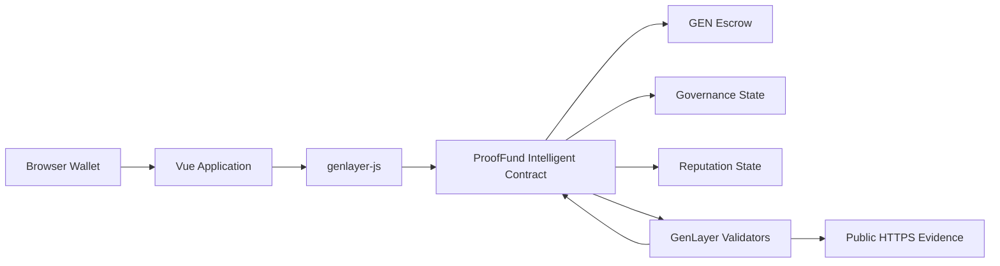

# ProofFund

### Validator-governed capital for verifiable public work

[](https://abstrusimad.github.io/prooffund/)
[](https://explorer-studio.genlayer.com)
[](#quality-and-testing)
[](LICENSE)

**Live application:** [https://abstrusimad.github.io/prooffund/](https://abstrusimad.github.io/prooffund/)

ProofFund is a full-stack GenLayer dApp for financing projects through bounded
funding tranches, explicit delivery milestones, public evidence, validator
consensus, bonded disputes, and contribution-weighted governance. It replaces
simple payment promises with an auditable lifecycle in which capital, evidence,
decisions, appeals, and reputation remain connected on-chain.


## Live StudioNet Deployment

| Resource | Value |
| --- | --- |
| Network | GenLayer StudioNet |
| Intelligent Contract | `0x2aB48F7021Bdda0435e5284D805235E8b16A8f18` |
| Deployment transaction | [`0x5940...1c8e`](https://explorer-studio.genlayer.com/tx/0x5940ed6fca9b66c20f480935f4b1545343fcbfe4fadc6ff0ab2e938d88cd1c8e) |
| Live registry | 9 projects |
| Funding tranches | 27 on-chain tranches |
| Committed capital | 57 GEN |
| Governance | 3 open proposals with weighted votes |
| Adjudication | 3 open bonded disputes |

All registry data displayed by the application is read directly from StudioNet.
Project creation, tranche funding, proposals, votes, evidence submissions,
milestone evaluations, disputes, and claims are real contract transactions.

## Why ProofFund

Traditional crowdfunding releases capital before outcomes can be objectively
inspected. Basic oracle dApps often stop after returning a consensus answer.
ProofFund turns GenLayer consensus into a complete coordination protocol:

1. Creators define a project, staged capital requirements, and measurable
   milestone acceptance criteria.
2. Sponsors fund individual tranches while funds remain in contract escrow.
3. Creators submit public HTTPS evidence for completed milestones.
4. GenLayer validators inspect the evidence using LLM-backed web reasoning.
5. Accepted outcomes release claimable capital; weak evidence receives a
   durable explanation instead of an opaque failure.
6. Participants can open bonded disputes with counter-evidence.
7. Contributors govern project signals and executable funding actions using
   contribution-weighted votes.

## Core Capabilities

### Staged Funding

- Multiple bounded tranches per project
- Independent tranche targets, deadlines, status, and backer counts
- Payable StudioNet transactions with exact remainder checks
- Automatic project activation after full funding
- Escrow accounting for committed, released, and claimable GEN

### Intelligent Milestone Adjudication

- Explicit project-specific acceptance criteria
- Public evidence URL and evidence-note submission
- LLM-backed validator evaluation through GenLayer consensus
- Structured verdict, score, analysis, and findings persisted on-chain
- Resubmission support for rejected or incomplete evidence
- Graceful rejection when external evidence cannot be reached

### Governance

- Proposals created by project creators or contributors
- Contribution-weighted voting with one vote per address
- Snapshot quorum equal to 20% of funded capital
- Signal, deadline-extension, funding-pause, and funding-reopen actions
- Permissionless finalization after the voting deadline
- Executable approved actions and permanent voting records

### Disputes and Reputation

- Bonded challenges against milestone verdicts
- Public counter-evidence and validator re-adjudication
- Overturn and uphold outcomes
- Reputation for projects created, projects backed, approved milestones,
  disputes won/lost, proposals created, votes cast, funding, and earnings

### Production Frontend

- Responsive Vue interface for desktop and mobile
- Persistent wallet reconnection after refresh
- Transaction lifecycle feedback from signature through consensus
- Human-readable GenVM rollback decoding
- StudioNet saturation retries and recoverable loading states
- Local project media with deterministic fallbacks
- Direct links to the current StudioNet explorer

## Architecture



The frontend has no private backend or mock-data service. Reads and writes use
`genlayer-js` directly. The Intelligent Contract owns protocol state, access
control, escrow accounting, voting, consensus calls, dispute resolution, and
claimable balances.

See [docs/ARCHITECTURE.md](docs/ARCHITECTURE.md) for trust boundaries and
contract-level design details.

## Repository Structure

```text
prooffund/
|-- contracts/proof_fund.py        # Production Intelligent Contract
|-- app/                           # Vue + Vite frontend
|   |-- public/projects/           # Reliable local project media
|   `-- src/                       # Views, store, services, components
|-- deploy/                        # GenLayer CLI deployment script
|-- deployments/studionet.json     # Public deployment metadata
|-- scripts/                       # Idempotent live-state preparation tools
|-- tests/direct/                  # Fast direct-mode contract tests
|-- tests/integration/             # StudioNet integration smoke test
|-- docs/ARCHITECTURE.md
`-- .github/workflows/             # GitHub Pages deployment
```

## Local Development

### Prerequisites

- Node.js 22+
- pnpm through Corepack
- Python 3.11+
- GenLayer CLI and GenVM linter
- A browser wallet configured for StudioNet

### Install and run

```bash
git clone https://github.com/AbstrusImad/prooffund.git
cd prooffund

corepack pnpm install
cd app
corepack pnpm install
cp .env.example .env
corepack pnpm run dev
```

Open `http://localhost:5173`.

The committed `.env.example` contains only public network configuration. Real
`.env` files and private keys are excluded by the root `.gitignore`.

## Quality and Testing

Validate the Intelligent Contract:

```bash
genvm-lint check contracts/proof_fund.py
python -m pytest tests/direct -q
```

Build the frontend:

```bash
cd app
corepack pnpm run build
```

Current verification baseline:

- GenVM lint: passed
- Direct contract tests: 8 passed
- Frontend production build: passed
- Desktop and mobile browser inspection: passed
- StudioNet state verification: 9 projects, 27 tranches, 57 GEN, 3 proposals,
  and 3 disputes

## Deployment

### Intelligent Contract

```bash
npx genlayer deploy
```

Deployment uses `gltest.config.yaml` and reads the wallet key from the local
environment. Never commit a funded private key.

### GitHub Pages

Every push to `main` runs `.github/workflows/deploy-pages.yml`. The workflow:

1. Installs the locked frontend dependencies.
2. Injects the public StudioNet contract and explorer configuration.
3. Builds the Vite application under the `/prooffund/` base path.
4. Adds an SPA fallback for direct project and governance routes.
5. Publishes the artifact to GitHub Pages.

## Security Notes

- No private key is bundled into the application or repository.
- Wallet signatures are requested only for explicit write operations.
- Funding and dispute bonds are accounted for by the contract.
- Governance votes cannot be replayed by the same address.
- Consensus output is normalized and validated before state transitions.
- External evidence failures produce inspectable outcomes instead of silently
  corrupting escrow state.
- This is a StudioNet deployment intended for demonstration and protocol
  testing; it has not undergone a third-party security audit.

## License

Released under the [MIT License](LICENSE).
