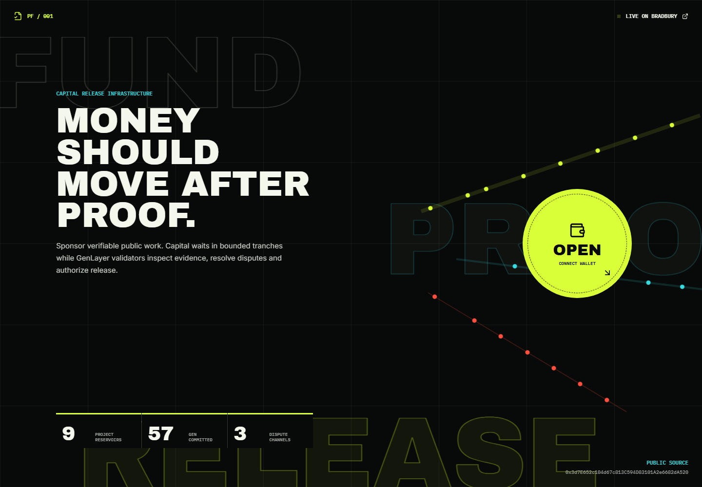
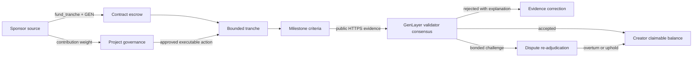

# ProofFund

**A pressure map for accountable capital on GenLayer Bradbury**

[Enter the live protocol](https://abstrusimad.github.io/prooffund/) |
[Inspect the contract](https://explorer-bradbury.genlayer.com/address/0x3d7E652c104d67c813C594D83101A2e6682dA520) |
[Trace the deployment](https://explorer-bradbury.genlayer.com/tx/0x41a65eabb5aedbb0493db8c94da2c21f04dbe290cd7df4721b95390d89dcc0cf)



## The Pressure Test

Funding usually moves before anyone can inspect whether the promised outcome
exists. ProofFund reverses that sequence. Sponsors inject GEN into bounded
tranches, the contract holds it, creators publish evidence, and independent
GenLayer validators decide whether each acceptance condition has actually been
met. Capital advances only after the evidence gate opens.

This is not a consensus-answer wrapper. Validator judgment changes durable
protocol state: it records a reasoned verdict, releases escrow, creates
claimable balances, enables a bonded appeal path, updates reputation, and can
advance the project lifecycle.

## Live Pressure Readings

The public deployment currently exposes:

- **9** project reservoirs
- **27** bounded funding tranches
- **57 GEN** committed through real Bradbury transactions
- **3** open contribution-weighted proposals
- **3** open bonded disputes
- **0** mocked protocol records

| Network proof | Value |
|---|---|
| Chain | GenLayer Bradbury, chain ID `4221` |
| Intelligent Contract | `0x3d7E652c104d67c813C594D83101A2e6682dA520` |
| Deployment transaction | [`0x41a65e...dcc0cf`](https://explorer-bradbury.genlayer.com/tx/0x41a65eabb5aedbb0493db8c94da2c21f04dbe290cd7df4721b95390d89dcc0cf) |
| Explorer | [explorer-bradbury.genlayer.com](https://explorer-bradbury.genlayer.com) |
| Repository | [AbstrusImad/prooffund](https://github.com/AbstrusImad/prooffund) |
| Application | [abstrusimad.github.io/prooffund](https://abstrusimad.github.io/prooffund/) |

Every number shown in the application is read from the deployed contract. The
frontend has no protocol-data fixture, private indexing API, or fallback record
set.

## Follow One Unit of GEN



The same route appears in the interface as a live capital field. Projects are
vertical reservoirs, tranche and evidence state become connected channels, and
every write becomes an animated current. The current remains active through
wallet signature and validator consensus, then stops in a persistent accepted
or failed result with the transaction hash and a Bradbury explorer link.

## Verifiable Network Migration

The Bradbury release was reconstructed from an audited StudioNet snapshot,
whose SHA-256 digest is
`7eaf1828878b3fe0c9885dcdc5dc64711cf8d2a0bf8e59aed8a0553bdee274b5`.
Projects, tranches, milestones, funding, governance, and votes were replayed
through their native public contract methods. Historical validator verdicts
and their three bonded disputes are restored once through an owner-gated,
hash-locked method backed by exactly `0.3 GEN`. The deployment manifest records
every Bradbury transaction, so the migration can be independently traced
without trusting a frontend fixture.

## Contract State Channels

**Project channel.** A creator publishes identity, public context, a goal,
deadline, and initial tranche. Additional tranches cannot push the combined
target beyond the project goal.

**Escrow channel.** Sponsors fund a selected tranche with payable GEN.
Accounting tracks contribution weight, total escrow, released value, and
claimable balances without trusting the frontend.

**Evidence channel.** A milestone binds a title, amount, deadline, acceptance
criteria, and evidence requirements. Creators submit a public HTTPS source and
an explanatory note.

**Intelligence channel.** Validators inspect project context, criteria, and
evidence using LLM-backed web reasoning. The contract normalizes the response
into a verdict, score, analysis, and findings before changing state.

**Challenge channel.** A participant can post a GEN bond and counter-evidence.
Consensus re-evaluates the record and persists whether the original verdict was
upheld or overturned.

**Governance channel.** Contributors receive voting weight from actual funding.
Proposals can signal intent or execute project actions such as pausing funding,
reopening it, or extending a deadline after quorum and finalization.

**Reputation channel.** Address profiles accumulate projects created, projects
backed, funded value, approved milestones, disputes won or lost, proposals,
votes, earnings, and claims.

## Decision Envelope

Milestone evaluation is deliberately constrained. Validators receive the
project-specific acceptance conditions, evidence URL, submission note, and
relevant project context. The equivalence principle asks the network to agree
on the normalized decision rather than identical prose.

A successful result persists:

```text
verdict      APPROVED | REJECTED
score        bounded numeric confidence
analysis     readable project-specific reasoning
findings     normalized evidence observations
state effect milestone transition + escrow release when approved
```

Unreachable, generic, stale, or insufficient evidence does not silently pass.
Expected weakness becomes a durable rejection explanation. External and
transient failures remain distinguishable from an evidence verdict, while
frontend error extraction inspects GenVM receipt payloads to avoid
`[object Object]` and opaque rollback messages.

## Public Method Surface

| Family | Writes | Reads |
|---|---|---|
| Projects | `create_project`, `add_funding_tranche` | `get_projects`, `get_project`, `get_dashboard` |
| Capital | `fund_tranche`, `fund_project`, `claim` | `get_tranches`, `get_contribution`, `get_profile` |
| Delivery | `add_milestone`, `submit_evidence`, `evaluate_milestone` | `get_milestones` |
| Appeals | `open_dispute`, `resolve_dispute` | `get_disputes` |
| Governance | `create_proposal`, `vote_proposal`, `finalize_proposal` | `get_proposals`, `get_governance`, `get_vote` |

Authorization, text bounds, payable-value checks, deadlines, status transitions,
single-vote rules, quorum, and accounting invariants are enforced inside
`contracts/proof_fund.py`.

## Operator Interface

The Vue application is organized as four perimeter routes:

- **FLOW** maps the live registry, capital totals, project fill levels, and
  Bradbury status.
- **SOURCE** creates a project through sequential input channels with immediate
  validation.
- **VOTE** exposes open, passed, and rejected governance branches with weighted
  totals.
- **CLAIM** reads the connected address profile, owned projects, reputation,
  and claimable GEN.

A disconnected visitor always enters through the dedicated wallet source valve.
After explicit connection, the choice is persisted in
`prooffund.wallet.connected`; refresh silently restores the session when the
wallet still exposes the account. The operational shell is never rendered for
an unconnected wallet.

The responsive model is structural, not a scaled desktop. Horizontal capital
routes become a vertical river, edge navigation moves into a thumb-reachable
current, action gates become bottom chambers, and transaction results stay
visible above the route controls.

## Repository Cross-Section

```text
contracts/proof_fund.py          Intelligent Contract and protocol invariants
tests/direct/                    Direct-mode lifecycle and adversarial tests
tests/integration/               Bradbury integration checks
deploy/                          GenLayer deployment entrypoint
deployments/bradbury.json        Canonical public deployment and transaction manifest
scripts/                         Idempotent live-state preparation
app/src/services/genlayer.js     SDK reads, writes, retries, receipt decoding
app/src/stores/proofFund.js      Wallet persistence and transaction state machine
app/src/views/                   Flow, source, project, vote, and claim surfaces
.github/workflows/               Locked GitHub Pages publication
```

The architecture and trust boundaries are expanded in
[`docs/ARCHITECTURE.md`](docs/ARCHITECTURE.md).

## Bring Up a Local Current

Requirements: Node.js 22+, Corepack, pnpm, Python 3.11+, GenVM lint tooling, and
a Bradbury-compatible browser wallet.

```bash
git clone https://github.com/AbstrusImad/prooffund.git
cd prooffund
corepack pnpm install

cd app
corepack pnpm install
cp .env.example .env
corepack pnpm run dev
```

Open `http://localhost:5173`. The frontend recognizes only these public
variables:

```dotenv
VITE_CONTRACT_ADDRESS=<deployed intelligent contract address>
VITE_EXPLORER_URL=<current Bradbury explorer origin>
```

No wallet key belongs in a Vite variable. Root and nested `.env` files are
ignored; only value-free or public `.env.example` files may be committed.

## Verification Bench

```bash
genvm-lint check contracts/proof_fund.py
python -m pytest tests/direct -q

cd app
corepack pnpm run build
```

Current release evidence:

- GenVM lint passed.
- 9 direct contract tests passed.
- The production Vite build passed.
- Desktop and mobile browser inspection passed with no runtime console errors.
- Live reads returned 9 projects, 27 tranches, 57 funded GEN, 3 proposals, and
  3 disputes.
- Wallet restoration, direct routes, local image fallbacks, action gates,
  transaction terminal states, and readable receipt failures are implemented.

## Deployment Boundary

`npx genlayer deploy` uses `gltest.config.yaml` and obtains the deployer
credential from the local environment. The credential is never read by the
frontend, copied into build output, or stored in deployment metadata.

Pushes to `main` trigger `.github/workflows/deploy-pages.yml`. The workflow
installs locked dependencies, injects only the public contract and explorer
values, builds with `/prooffund/` as its base path, creates the SPA fallback,
and publishes to GitHub Pages.

## Security Posture

- Explicit wallet approval is required for every write.
- A global transaction guard rejects duplicate submissions during signature or
  consensus.
- Funding and dispute bonds are contract-accounted.
- Consensus output is normalized before state mutation.
- Accepted writes refresh live state while preserving the terminal receipt.
- Saturated Bradbury reads and writes use bounded backoff.
- Project images use local deterministic fallbacks.
- The deployment is a Bradbury testnet protocol release, not an audited mainnet
  financial product.

## Release Mark

ProofFund is published under the [MIT License](LICENSE). The contract address,
deployment transaction, live application, and repository above are the
canonical references for this release.
